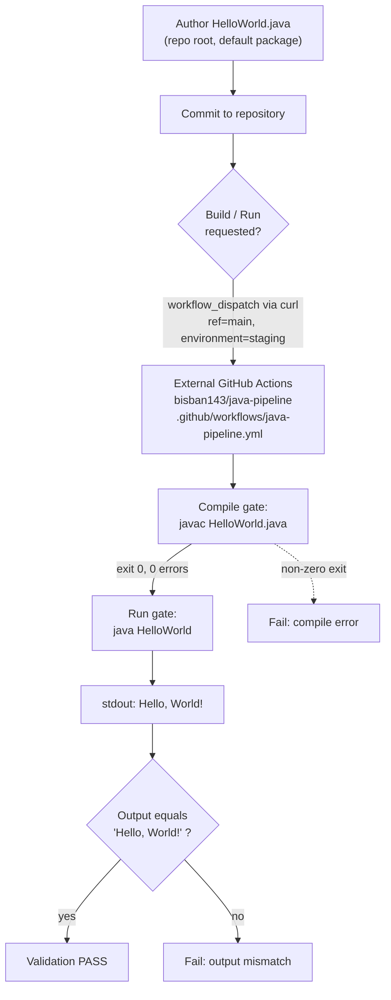

# Technical Specification

# 0. Agent Action Plan

## 0.1 Intent Clarification

This Agent Action Plan is the definitive interpretation layer between the user's request and the implementation that the Blitzy platform will perform. It translates the "Add HelloWorld Java" request into a precise, file-level execution plan against the current repository, which is an empty/greenfield project containing only a placeholder `README.md` [README.md:L1].

### 0.1.1 Core Feature Objective

Based on the prompt, the Blitzy platform understands that the new feature requirement is to **add a single, canonical, dependency-free "Hello World" program written in Java to the repository**, such that compiling and running it prints exactly the line `Hello, World!` to standard output. The prompt states this is "the complete and total scope of the deliverable," so the feature is deliberately minimal and self-contained.

The requirement decomposes into the following discrete, technically-precise sub-requirements:

- **R1 — Single source file:** Create exactly one Java source file named `HelloWorld.java`.
- **R2 — Single class:** Declare exactly one top-level public class named `HelloWorld`. The file name must match the public class name (Java Language Specification requirement for public top-level types).
- **R3 — Standard entry point:** Provide the canonical JVM entry point with the signature `public static void main(String[] args)`.
- **R4 — Prescribed output method:** Emit the message using `System.out.println(...)` with the literal argument `"Hello, World!"`.
- **R5 — Character-exact output:** The printed line must match character-for-character — capital `H`, lowercase `ello`, a comma, a single ASCII space, capital `W`, lowercase `orld`, and a trailing exclamation mark — producing `Hello, World!`.
- **R6 — Target runtime:** Target Java 17 or newer. Because no repository manifest declares a version (no `pom.xml`, `build.gradle`, or CI matrix exists), the resolved target is **Java 17 (LTS)**, the explicitly documented lower bound from the prompt.

**Implicit requirements surfaced** (necessary but not stated verbatim):

- **I1 — Default (unnamed) package:** The run gate `java HelloWorld` references the class with no package qualifier, therefore the source must NOT declare a `package` statement. Introducing a package would break the documented run command.
- **I2 — Repository-root placement:** Both validation commands assume `HelloWorld.java` (compile) and `HelloWorld` (run) resolve in the current working directory, so the file must be created at the repository root with no `src/` path prefix.
- **I3 — Trailing newline is acceptable:** `System.out.println` appends a single line terminator after the message; the "character-for-character" check applies to the line content `Hello, World!`, and the conventional trailing newline is expected and acceptable.
- **I4 — Plain encoding:** The source must be plain ASCII/UTF-8 with no byte-order mark so that `javac` compiles without warnings or errors.
- **I5 — No imports:** No `import` statements are required because `System` and `String` reside in `java.lang`, which is implicitly imported.

**Feature dependencies and prerequisites:** None. This is a greenfield addition to an empty repository [README.md:L1]; there is no upstream module, framework, service, or data store to integrate with. The only runtime prerequisite is a JDK 17 toolchain, which is supplied by the external build/run environment rather than declared as a project dependency.

### 0.1.2 Special Instructions and Constraints

The prompt establishes a strict "Boundaries & Preservation" envelope. These are hard, non-negotiable constraints that govern every downstream action:

- **C1 — Exactly one `.java` file:** No additional source files may be created.
- **C2 — Exactly one class:** No nested, secondary, or multi-class structure is permitted.
- **C3 — No external dependencies or build tools:** Never introduce external dependencies, build tools (Maven, Gradle), or frameworks.
- **C4 — No auxiliary code:** Never add logging libraries, test classes, or a multi-class structure.
- **C5 — Limited authority:** The implementing role's authority is explicitly limited to a single-class, dependency-free Java program; there is no authority to introduce build tooling, frameworks, or multi-file structures.
- **C6 — Build/run delegation (from environment setup instructions):** The application must NOT be built or run locally. Build and run actions are delegated to an external GitHub Actions pipeline (repository `bisban143/java-pipeline`, workflow `.github/workflows/java-pipeline.yml`), triggered via a `workflow_dispatch` REST call with inputs `{"ref":"main","inputs":{"environment":"staging"}}`.

**Architectural requirements:** Follow the simplest viable Java structure — a default-package, single-class console program. There is no existing service pattern, repository convention, or module layout to conform to because the repository is empty [README.md:L1].

**Preserved user material (reproduced exactly as provided):**

> **User Example — Technical Specifications:**
> - Language: Java 17+
> - File: `HelloWorld.java`
> - Class: `HelloWorld`
> - Entry point: `public static void main(String[] args)`
> - Output method: `System.out.println`

> **User Example — Validation Framework:**
>
> | Gate | Command | Expected Result |
> | --- | --- | --- |
> | Compile | `javac HelloWorld.java` | Exit code 0, 0 errors |
> | Run | `java HelloWorld` | `Hello, World!` printed to stdout |

**Web search requirements:** None. The implementation relies only on foundational Java knowledge (the canonical Hello World idiom and the JDK standard library); no external research, library recommendation, or version lookup is required.

### 0.1.3 Technical Interpretation

These feature requirements translate to the following technical implementation strategy:

- To deliver the program (R1–R6, I1–I5), we will **create** a new file `HelloWorld.java` at the repository root containing a single public class `HelloWorld` in the default package, with a `public static void main(String[] args)` method whose body is a single `System.out.println("Hello, World!");` statement.
- To honor the boundary constraints (C1–C5), we will **add no other artifacts** — no second source file, no package declaration, no `import` statements, no build manifest, no test class, and no framework or dependency wiring.
- To honor the build/run delegation (C6), we will **reference** the external GitHub Actions pipeline as the mechanism that executes the two validation gates (`javac HelloWorld.java` and `java HelloWorld`); no local build or run is performed and no in-repository CI file is created.
- To preserve the existing repository identity, the placeholder `README.md` is left **unchanged** [README.md:L1].

The net result is a single CREATE operation with zero modifications to existing files and one external (reference-only) integration touchpoint.

## 0.2 Repository Scope Discovery

A complete inspection of the repository was performed to identify every file and integration surface relevant to this feature. The repository was traversed via directory listing across all branches (`blitzy`, `master`, `origin/master`, `origin/blitzy`), folder-structure indexing, and corroborated against the Technical Specification's Repository State of Record.

### 0.2.1 Comprehensive File Analysis

The repository is empty/greenfield. The only tracked, non-`.git` artifact is `README.md`, which contains a single Markdown heading `# empty-repo` [README.md:L1]. This is confirmed by the Repository State of Record, which records a total file count of 1, a subdirectory count of 0, and a single initial commit `1dd9807` (§1.4.1, §1.4.2).

The following table inventories the full repository and the disposition of each entry for this feature:

| Path | Type | Current State | Disposition for This Feature |
|------|------|---------------|------------------------------|
| `README.md` | File | Placeholder heading `# empty-repo` [README.md:L1] | REFERENCE — unchanged |
| `.git/` | Directory | Version-control metadata (commit `1dd9807`) | Not applicable (VCS internals) |
| `HelloWorld.java` | File | Does not exist yet | **CREATE** — the deliverable |

**Integration point discovery** (exhaustive — all categories evaluated):

- **API endpoints connecting to the feature:** None. No web/HTTP layer exists in the repository (§3.9.1).
- **Database models / migrations affected:** None. No persistence layer, schema, or migration tooling is present (§1.4.3).
- **Service classes requiring updates:** None. No source code of any language exists (§3.4.1).
- **Controllers / handlers to modify:** None.
- **Middleware / interceptors impacted:** None.
- **Application bootstrap / dependency injection / module registries:** None — there is no existing entry point or container to wire into.
- **Build / CI configuration in the repository:** None present. There is no `.github/` directory, build script, or pipeline definition in the repository (§3.9.1).

The only genuine integration touchpoints are (a) **filesystem placement** — the new file must reside at the repository root so that `javac HelloWorld.java` and `java HelloWorld` resolve the source and its default-package class — and (b) the **external GitHub Actions pipeline** used for build/run, described in section 0.3.2.

### 0.2.2 Web Search Research Conducted

No web search research was conducted or required for this feature. The deliverable is a foundational, well-established Java idiom implemented entirely with the JDK standard library. Specifically:

- Best practices for the feature type (a console "Hello World") are canonical and unambiguous.
- No third-party library recommendation is needed — the program uses only `java.lang` types.
- No integration pattern research applies — there are no systems to integrate with.
- No feature-specific security research applies — the program reads no input, performs no I/O beyond a single stdout write, and exposes no attack surface.

### 0.2.3 New File Requirements

Exactly one new file is required. No new test files and no new configuration files are created (creating either would violate constraints C1 and C4).

- **New source file:**
  - `HelloWorld.java` (repository root) — the complete deliverable: a default-package, single public class `HelloWorld` whose `main` method prints `Hello, World!` to stdout via `System.out.println`.
- **New test files:** None. Test classes are explicitly prohibited (C4); validation is performed exclusively through the Compile and Run gates executed by the external pipeline.
- **New configuration files:** None. No build manifest, environment file, or pipeline definition is added to the repository (C3, C5); build/run configuration lives in the external `bisban143/java-pipeline` repository.

## 0.3 Dependency and Integration Analysis

### 0.3.1 Dependency Inventory

There are **no dependency changes** of any kind for this feature — no additions, no updates, and no removals. The deliverable is dependency-free by mandate (constraint C3).

- No package manifest exists in the repository today (no `pom.xml`, `build.gradle`, `package.json`, or `*.toml`), and none will be created (§1.4.3, §3.9.1).
- The program uses only the JDK standard library: `java.lang.System` (for `System.out`) and `java.lang.String`, both members of `java.lang`, which is implicitly imported. No `import` statement is needed.
- The sole runtime requirement is the **Java 17 (LTS) JDK** itself, which is provided by the external build/run environment rather than declared as a project-level dependency. No lock files are introduced.

Because there are no public or private package changes, no dependency registry table is applicable.

### 0.3.2 Existing Code Touchpoints

This feature introduces a single new file and performs **no modifications to existing code**. The empty repository offers no source, configuration, or schema to wire into [README.md:L1].

- **Direct source modifications required:** None. There is no `main`/bootstrap file, route registry, model index, or service container to update.
- **Dependency injection / service registration:** None.
- **Database / schema updates:** None.
- **Placement integration (the only in-repository touchpoint):** `HelloWorld.java` must be created at the repository root so the default-package class compiles and runs with the documented commands. No existing file references or imports the new class.

**External build & run integration (REFERENCE — not modified in this repository):**

Per the environment setup instructions, building and running are delegated to an external GitHub Actions pipeline rather than executed locally. The relevant facts:

| Attribute | Value |
|-----------|-------|
| External repository | `bisban143/java-pipeline` |
| Workflow file | `.github/workflows/java-pipeline.yml` (resides in the external repo, not this one) |
| Trigger mechanism | `workflow_dispatch` via authenticated REST `POST` |
| Dispatch payload | `{"ref":"main","inputs":{"environment":"staging"}}` |
| Authorization | `Bearer ${GITHUB_PAT}` header |

This workflow is the agent's substitute for local `javac`/`java` execution and serves as the runner for the Compile and Run validation gates. It is **external to this repository** (confirmed absent here per §1.4.3 and §3.9.1) and therefore is not added to or edited within the in-scope file set. Placing `HelloWorld.java` at the repository root is consistent with the documented gate commands (`javac HelloWorld.java`, `java HelloWorld`), so no change is required from this repository's side to enable the external pipeline.

## 0.4 Technical Implementation

### 0.4.1 File-by-File Execution Plan

Every file in scope is listed below with its operation mode. There is exactly one CREATE and zero UPDATE/DELETE operations.

| Mode | Path | Purpose |
|------|------|---------|
| **CREATE** | `HelloWorld.java` (repo root) | Single public class `HelloWorld` in the default package; `main` prints `Hello, World!` via `System.out.println`. The complete deliverable. |
| **REFERENCE** | `README.md` | Existing repository identity marker (`# empty-repo`); left unchanged [README.md:L1]. |
| **REFERENCE (external)** | `bisban143/java-pipeline` → `.github/workflows/java-pipeline.yml` | External build/run pipeline executing the Compile and Run gates; not edited in this repository. |

The intended contents of the new file are the canonical, minimal Java program:

```java
public class HelloWorld {
    public static void main(String[] args) {
        System.out.println("Hello, World!");
    }
}
```

### 0.4.2 Implementation Approach per File

**`HelloWorld.java` (CREATE):**

- Declare a single top-level `public class HelloWorld` with **no `package` statement** so the default (unnamed) package is used and `java HelloWorld` resolves the class (I1).
- Add **no `import` statements**; `System` and `String` come from the implicitly imported `java.lang` package (I5).
- Implement the standard entry point `public static void main(String[] args)` (R3).
- The method body is a single statement: `System.out.println("Hello, World!");`, producing the character-exact line followed by a single line terminator (R4, R5, I3).
- Save as plain UTF-8/ASCII with no byte-order mark to guarantee a clean `javac` compile (I4).
- Place the file at the repository root, with no `src/` prefix, so both validation gate commands resolve it (I2).

**`README.md` (REFERENCE — unchanged):** No edit. The placeholder remains the repository identity marker; documentation expansion is out of scope.

**External pipeline (REFERENCE — unchanged):** The build and run gates are executed by triggering the external GitHub Actions workflow; no local build/run is performed and no in-repository workflow file is created (C6).

There are no Figma URLs or design references associated with any file in this feature.

The end-to-end build, run, and validation flow — including the delegation of build/run to the external pipeline — is depicted below:



### 0.4.3 User Interface Design

Not applicable. This deliverable is a console program whose only "interface" is a single line written to standard output. There is no graphical, web, or terminal-interactive UI; no Figma attachments were provided; and no component library or design system is specified. Consequently, the Design System Compliance and Figma Design Analysis sub-sections do not apply to this feature.

## 0.5 Scope Boundaries

### 0.5.1 Exhaustively In Scope

The complete in-scope file set for this feature is a single created file. There are no Figma assets to include.

- **Source (CREATE):**
  - `HelloWorld.java` — the entire deliverable: default-package, single public class `HelloWorld`, `public static void main(String[] args)`, printing `Hello, World!` via `System.out.println`.
- **Consulted but unmodified (REFERENCE):**
  - `README.md` — existing repository identity marker, left unchanged [README.md:L1].
  - `bisban143/java-pipeline` → `.github/workflows/java-pipeline.yml` — external build/run pipeline used to execute the validation gates.
- **Validation gates that must pass:**
  - Compile: `javac HelloWorld.java` → exit code 0, 0 errors.
  - Run: `java HelloWorld` → stdout exactly `Hello, World!`.

### 0.5.2 Explicitly Out of Scope

The following are explicitly excluded, both by the prompt's hard constraints and to keep the deliverable minimal:

- **Build tooling of any kind:** Maven (`pom.xml`), Gradle (`build.gradle`, `settings.gradle`), Ant, or Make (C3, C5).
- **Frameworks and external dependencies:** Any third-party library, including logging libraries such as Log4j or SLF4J (C3, C4).
- **Additional source files or multi-class structure:** Any second `.java` file, additional top-level or nested classes, or package sub-trees (C1, C2, C4).
- **Test code:** JUnit or any test class or test harness — validation is performed via the Compile/Run gates only (C4).
- **Documentation changes:** Edits to `README.md` or new documentation files; the placeholder remains as-is.
- **In-repository CI/CD, container, IaC, or environment files:** No `.github/` workflow, `Dockerfile`, Terraform, or `.env` is added; build/run is delegated externally (C6).
- **Structural relocation or packaging:** Adding a `package` declaration, introducing a `src/` directory layout, or moving the file off the repository root — any of these would break the documented `java HelloWorld` run gate (I1, I2).
- **Unrelated work:** Any feature, refactor, or performance optimization not required to deliver the Hello World program.

## 0.6 Rules for Feature Addition

No separate user-specified implementation rules were provided (the rules input was empty). The governing rules for this feature therefore derive entirely from the prompt's explicit directives and the environment setup instructions, and are restated here as binding requirements:

- **Single-file, single-class discipline:** The deliverable must be exactly one `.java` file containing exactly one class named `HelloWorld`. No additional files or classes may be introduced.
- **Zero-dependency, zero-build-tool rule:** No external dependencies, build tools (Maven, Gradle), or frameworks may be added. The implementation must rely solely on the JDK standard library.
- **No auxiliary code rule:** No logging libraries, test classes, or multi-class structures may be added.
- **Exact-output rule:** The program must print `Hello, World!` exactly — capital `H`, capital `W`, a comma, and a single space — and must satisfy both validation gates (`javac HelloWorld.java` compiles with 0 errors; `java HelloWorld` prints the exact line).
- **Default-package / root-placement convention:** Because the run gate is `java HelloWorld` with no package qualifier, the class must remain in the default package and the file must live at the repository root.
- **Build/run delegation requirement:** The application must not be built or run locally. Build and run are triggered through the external GitHub Actions pipeline (`bisban143/java-pipeline`, workflow `.github/workflows/java-pipeline.yml`) via a `workflow_dispatch` REST call with payload `{"ref":"main","inputs":{"environment":"staging"}}` and a `Bearer ${GITHUB_PAT}` authorization header.
- **Authority limitation:** The implementing role's authority is bounded to the single-class, dependency-free program; it may not expand scope into build infrastructure, frameworks, or multi-file structures.

There are no additional performance, scalability, or security requirements beyond the above. The program performs a single stdout write, accepts no input, and exposes no external interface, so it carries no meaningful performance or security surface.

## 0.7 Attachments

No attachments were provided for this project.

- **File attachments (PDFs, images, documents):** None. The `review_attachments` check returned "No attachments found for this project," so there are no supplementary documents to summarize.
- **Figma screens (frames / URLs):** None. No Figma designs, frames, or URLs were supplied; consequently there is no design-to-component mapping, token manifest, or UI specification associated with this feature.

All requirements for this feature are fully specified by the prompt text itself, which is self-contained and references no external files, style guides, or design sources.

