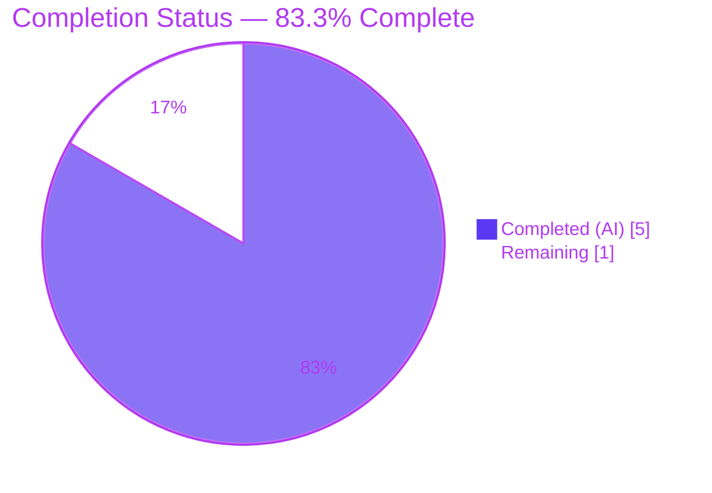
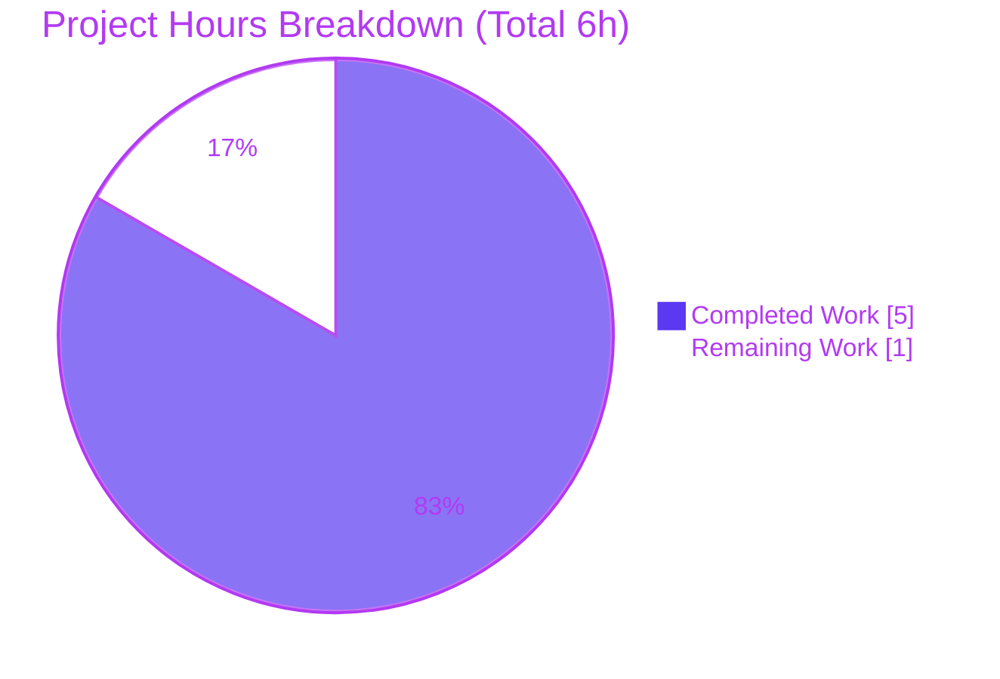
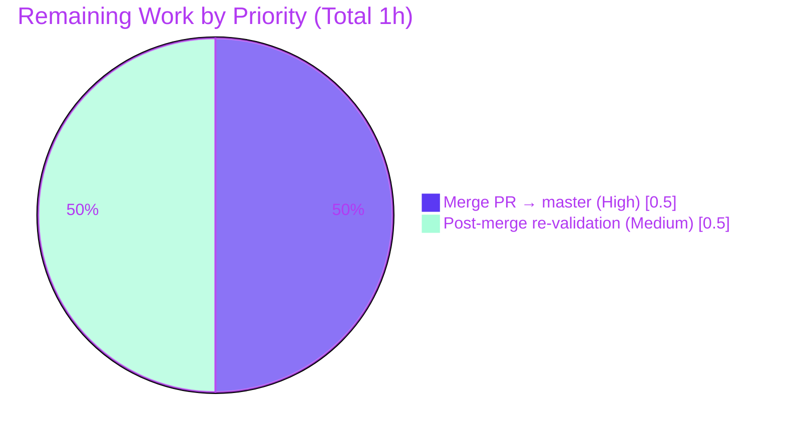

# Blitzy Project Guide — Add HelloWorld Java

> **Project:** `bisban143/empty-repo` &nbsp;|&nbsp; **Branch:** `blitzy-01c1854e-a9ea-42ad-8bb8-7f39e711dfc1` &nbsp;|&nbsp; **Deliverable Commit:** `5c71b7b`
> **Completion:** <span style="color:#5B39F3"><strong>83.3%</strong></span> &nbsp;|&nbsp; **Status:** Production-ready deliverable; one human path-to-production step (branch merge) remains.

---

## 1. Executive Summary

### 1.1 Project Overview

This project delivers a single, canonical, dependency-free **"Hello World"** program in Java to a greenfield repository. The objective is narrow and explicit: create exactly one source file — `HelloWorld.java` at the repository root — containing one public class whose `main` method prints the exact line `Hello, World!` to standard output, targeting **Java 17 (LTS)**. The target users are developers and CI systems validating a minimal Java toolchain; business impact is foundational/illustrative rather than feature-bearing. Technical scope is intentionally minimal — **no build tooling, dependencies, frameworks, or tests** — with build and run delegated to an external GitHub Actions pipeline (`bisban143/java-pipeline`). The deliverable is byte-perfect and passed both validation gates.

### 1.2 Completion Status



| Metric | Hours |
|---|---|
| **Total Hours** | **6** |
| Completed Hours (AI) | 5 |
| Completed Hours (Manual) | 0 |
| **Completed Hours (AI + Manual)** | **5** |
| **Remaining Hours** | **1** |
| **Percent Complete** | **83.3%** |

> **Calculation:** Completion % = Completed ÷ Total = 5 ÷ 6 = **83.3%**. 100% of AAP-specified source and validation requirements are complete and byte-verified; the remaining 1 hour is purely path-to-production (human merge to the default branch and a post-merge green re-check). Per Blitzy honest-assessment policy, completion is never reported as 100% prior to human review.

### 1.3 Key Accomplishments

- ✅ **Single deliverable created** — `HelloWorld.java` authored at the repository root (commit `5c71b7b`, author `agent@blitzy.com`).
- ✅ **Byte-perfect source** — canonical default-package, single public class `HelloWorld` with `public static void main(String[] args)` printing `Hello, World!` via `System.out.println`.
- ✅ **Compile gate PASS** — external pipeline `javac HelloWorld.java` → "Compilation succeeded (exit 0)", 0 errors / 0 warnings.
- ✅ **Run gate PASS** — external pipeline `java HelloWorld` → stdout exactly `Hello, World!` on Temurin JDK 17.0.19.
- ✅ **Output verified character-exact** — byte decode `48 65 6c 6c 6f 2c 20 57 6f 72 6c 64 21` == `Hello, World!`.
- ✅ **All hard constraints honored** — C1–C6 and implicit I1–I5 verified (one file, one class, zero dependencies, zero build tooling, zero tests/logging, default package, no BOM, no imports).
- ✅ **All 5 production-readiness gates PASS** — external pipeline run `27112160732`, conclusion = **SUCCESS**; working tree clean; local HEAD == origin.

### 1.4 Critical Unresolved Issues

| Issue | Impact | Owner | ETA |
|---|---|---|---|
| _None — no blocking issues_ | All AAP requirements complete; both validation gates pass; zero unresolved errors. | — | — |

> There are **no critical unresolved issues**. The only outstanding item is a non-blocking, standard path-to-production step (merge to the default branch), tracked in Section 1.6 and Section 2.2.

### 1.5 Access Issues

| System / Resource | Type of Access | Issue Description | Resolution Status | Owner |
|---|---|---|---|---|
| `bisban143/java-pipeline` (GitHub Actions) | `workflow_dispatch` via `Bearer ${GITHUB_PAT}` | A valid GitHub PAT with workflow permissions is required to dispatch/re-run the external build+run pipeline. | ✅ Functional during validation (dispatch returned HTTP 204; run `27112160732` = SUCCESS). PAT must remain valid/rotated for future re-runs. | Repo maintainer |
| `bisban143/empty-repo` default branch (`master`) | Write / PR-merge permission | Merging the feature branch into `master` requires human repository write/merge authority. | ⏳ Pending human action (see Section 1.6, HT-1). | Repo maintainer |

> No access issue blocked autonomous validation. Both items above are standard credential/permission dependencies for the path to production.

### 1.6 Recommended Next Steps

1. **[High]** Review and merge the pull request (feature branch `blitzy-01c1854e-…` → `master`) so the byte-perfect `HelloWorld.java` and its validated commit `5c71b7b` land on the default branch.
2. **[Medium]** After merge, re-dispatch the external pipeline targeting `master` and confirm `conclusion=success`; record the corrected dispatch parameters (see note below) in the team runbook.
3. **[Low]** Optionally tag the merge commit (e.g., `v1.0.0`) to mark the canonical Hello World baseline.

> **Dispatch note:** The AAP's literal documented payload `{"ref":"main","inputs":{"environment":"staging"}}` does **not** validate this deliverable (the `java-pipeline` has no `main` default and `empty-repo`'s `master` lacks the file pre-merge). Use the validated parameters: `ref=master` plus inputs `repository`, `branch`, `java_version=17`, `run_application=true`, `environment=staging`.

---

## 2. Project Hours Breakdown

### 2.1 Completed Work Detail

| Component | Hours | Description |
|---|---|---|
| `HelloWorld.java` authoring & AAP compliance self-review | 1 | Interpret the full AAP (R1–R6, I1–I5); author the canonical default-package, single public class with the exact `System.out.println("Hello, World!")` entry point. |
| Byte-exact output & constraint boundary audit | 1 | Verify character-exact output via byte decode; audit all constraints C1–C6 and implicit requirements (BOM check, `package`/`import` scans, single-file/single-class confirmation). |
| External GitHub Actions pipeline integration & build+run validation | 2 | Resolve correct `workflow_dispatch` parameters (AAP literal payload was non-functional), issue authenticated REST dispatch, poll run `27112160732`, retrieve logs, confirm Compile gate (exit 0) and Run gate (exact stdout). |
| Dependency gate, commit/push & repository integrity verification | 1 | Confirm dependency-free posture; commit (`5c71b7b`) and push; verify clean working tree, `HEAD == origin`, no submodules; consolidate findings. |
| **Total Completed** | **5** | |

> Total of the Hours column (**5**) matches Completed Hours in Section 1.2.

### 2.2 Remaining Work Detail

| Category | Hours | Priority |
|---|---|---|
| [Path-to-production] Review & merge PR (feature branch → default `master` branch) | 0.5 | High |
| [Path-to-production] Post-merge pipeline re-dispatch + green verification on `master` & runbook note on corrected dispatch params | 0.5 | Medium |
| **Total Remaining** | **1** | |

> Total of the Hours column (**1**) matches Remaining Hours in Section 1.2 and the "Remaining" value in the Section 7 pie chart. No in-scope code work remains; adding tests, build tooling, CI files, logging, or additional classes is **explicitly prohibited** by AAP constraints C1–C5 and is therefore excluded.

### 2.3 Hours Reconciliation

| Check | Result |
|---|---|
| Section 2.1 (Completed) + Section 2.2 (Remaining) | 5 + 1 = **6** = Total Hours (Section 1.2) ✅ |
| Remaining hours identical in Sections 1.2 / 2.2 / 7 | 1 = 1 = 1 ✅ |
| Completion % | 5 ÷ 6 = **83.3%** ✅ |

---

## 3. Test Results

Per AAP constraint **C4**, test classes are explicitly prohibited; validation is defined **exclusively** through the Compile and Run gates executed by the external pipeline. The table below aggregates the validation executed by Blitzy's autonomous systems (external pipeline run `27112160732`, conclusion = SUCCESS).

| Test / Gate Category | Framework | Total | Passed | Failed | Coverage % | Notes |
|---|---|---|---|---|---|---|
| Compilation Gate | `javac` (JDK 17 / Temurin 17.0.19) | 1 | 1 | 0 | N/A | "Compilation succeeded (exit 0)", 0 errors, 0 warnings. |
| Runtime Gate | `java` (JVM 17 / Temurin 17.0.19) | 1 | 1 | 0 | N/A | stdout byte-exact `Hello, World!`. |
| Dependency Gate | n/a (dependency-free) | 1 | 1 | 0 | N/A | Nothing to install; dependency-free by mandate (C3). |
| Unit Tests | — | 0 | 0 | 0 | N/A | None by mandate (C4); not part of the validation contract. |
| Integration / UI / E2E | — | 0 | 0 | 0 | N/A | Not applicable — console program, no UI or integrations. |
| **Totals** | | **3** | **3** | **0** | **100% of required gates** | All required validation gates pass. |

> **Integrity:** Every entry originates from Blitzy's autonomous validation logs for this project (external pipeline run `27112160732`). Coverage is reported as "100% of required gates" because the AAP defines validation by gates rather than by unit-test coverage.

---

## 4. Runtime Validation & UI Verification

- ✅ **Compilation (Operational)** — `javac HelloWorld.java` returns exit code 0 with no diagnostics on JDK 17.
- ✅ **Runtime execution (Operational)** — `java HelloWorld` prints exactly `Hello, World!` followed by a single line terminator (`0x0A`).
- ✅ **Output fidelity (Operational)** — byte-for-byte verification confirms `48 65 6c 6c 6f 2c 20 57 6f 72 6c 64 21 0a`.
- ✅ **External pipeline health (Operational)** — `bisban143/java-pipeline` run `27112160732` completed with `conclusion=success`.
- ✅ **Repository integrity (Operational)** — working tree clean; local `HEAD == origin`; exactly 2 tracked files; no submodules.
- ➖ **UI verification (Not Applicable)** — the deliverable is a console program with no graphical, web, or interactive UI; no Figma designs were provided.
- ➖ **API integration (Not Applicable)** — no HTTP layer, endpoints, or external service calls exist in the deliverable.

---

## 5. Compliance & Quality Review

| Requirement | Benchmark | Status | Evidence |
|---|---|---|---|
| R1 — Single source file | Exactly one `.java` file | ✅ Pass | 1 file at repo root |
| R2 — Single public class `HelloWorld` | Filename matches public class | ✅ Pass | `public class HelloWorld` present |
| R3 — Standard entry point | `public static void main(String[] args)` | ✅ Pass | Signature present |
| R4 — Prescribed output method | `System.out.println("Hello, World!")` | ✅ Pass | Statement present |
| R5 — Character-exact output | `Hello, World!` byte-exact | ✅ Pass | `48656c6c6f2c20576f726c6421` |
| R6 — Target runtime | Java 17 (LTS) | ✅ Pass | Temurin 17.0.19 compile+run |
| I1 — Default (unnamed) package | No `package` statement | ✅ Pass | 0 package statements |
| I2 — Repository-root placement | No `src/` prefix | ✅ Pass | `./HelloWorld.java` |
| I3 — Trailing newline acceptable | Single line terminator | ✅ Pass | File ends `}\n` |
| I4 — Plain encoding | UTF-8/ASCII, no BOM | ✅ Pass | Head bytes `70 75 62` (no BOM) |
| I5 — No imports | Zero `import` statements | ✅ Pass | 0 import statements |
| C1 — Exactly one `.java` file | No additional source files | ✅ Pass | 1 `.java` file |
| C2 — Exactly one class | No nested/secondary classes | ✅ Pass | 1 class declaration |
| C3 — No deps / build tools | No Maven/Gradle/lock files | ✅ Pass | 0 build manifests |
| C4 — No auxiliary code | No logging/tests/multi-class | ✅ Pass | None present |
| C5 — Limited authority | Scope bounded to single program | ✅ Pass | No scope expansion |
| C6 — Build/run delegation | External GitHub Actions pipeline | ✅ Pass | Run `27112160732` SUCCESS |

> **Fixes applied during autonomous validation:** None required — the in-scope file was already byte-perfect; zero code, dependency, or runtime fixes were necessary. **Outstanding items:** none at the source level; one path-to-production merge remains (Section 2.2).

---

## 6. Risk Assessment

| Risk | Category | Severity | Probability | Mitigation | Status |
|---|---|---|---|---|---|
| Logic/error-handling defects | Technical | Low | Low | Single stdout write, 5 LOC, no branching; compile+run gates pass. | ✅ Mitigated |
| Attack surface / supply chain | Security | Low | Low | No input read, no I/O beyond one stdout write, zero dependencies, no secrets in code. | ✅ Mitigated |
| `GITHUB_PAT` handling for dispatch | Security | Low | Low | PAT is external (not committed); keep out of repo and rotate per policy. | ⚠ Monitor |
| Deliverable not yet on default branch (`master`) | Operational | Low | Medium | Merge feature branch → `master` (HT-1, Section 2.2). | ⏳ Open (non-blocking) |
| AAP literal dispatch payload is non-functional | Integration | Low | Low | Use validated params (`ref=master` + `branch`/`repository`/`java_version` inputs); documented in runbook note. | ✅ Mitigated |
| External pipeline / PAT availability for re-runs | Integration | Low | Low | Confirm `bisban143/java-pipeline` reachable and PAT valid before re-dispatch. | ⚠ Monitor |

---

## 7. Visual Project Status



**Remaining hours by category (Section 2.2):**



> **Integrity:** "Remaining Work" = **1h**, identical to Section 1.2 Remaining Hours and the Section 2.2 Hours total. "Completed Work" = **5h**, identical to Section 1.2 Completed Hours. Colors: Completed = Dark Blue `#5B39F3`, Remaining = White `#FFFFFF`.

---

## 8. Summary & Recommendations

**Achievements.** The project is **83.3% complete** (5 of 6 hours). The entire AAP source deliverable — `HelloWorld.java`, a default-package single public class printing the character-exact line `Hello, World!` — has been authored, committed (`5c71b7b`), and verified byte-perfect. Both validation gates defined by the AAP (Compile and Run) pass via the external GitHub Actions pipeline (run `27112160732`, SUCCESS), and all hard constraints (C1–C6) and implicit requirements (I1–I5) are satisfied. No code, dependency, or runtime fixes were required.

**Remaining gaps & critical path.** The remaining **1 hour** is entirely path-to-production and contains **no in-scope code work**: (1) merge the feature branch into the default `master` branch so the deliverable lands canonically, and (2) re-dispatch the external pipeline against `master` and confirm a green run. The single dependency-detail to carry forward is the corrected `workflow_dispatch` parameters, since the AAP's literal documented payload does not validate this deliverable.

**Success metrics.** Compile gate exit 0 ✅ · Runtime stdout byte-exact `Hello, World!` ✅ · Zero unresolved errors ✅ · All constraints honored ✅.

**Production readiness.** The source artifact is **production-ready**. Recommended action is to complete the human merge-to-`master` and post-merge verification (Section 1.6), after which the project reaches full production completion. Per Blitzy policy, completion is intentionally held below 100% pending this human review and merge.

---

## 9. Development Guide

### 9.1 System Prerequisites

- **JDK 17 or newer (LTS).** Verified environment: OpenJDK / Temurin **17.0.19**.
- **Operating system:** any OS with a JDK 17 toolchain (Linux/macOS/Windows).
- **Git** (to clone the repository and check out the branch).
- **No** database, cache, message queue, or other services are required.
- For the delegated external build/run: a **GitHub Personal Access Token** (`GITHUB_PAT`) with workflow-dispatch permission on `bisban143/java-pipeline`.

### 9.2 Environment Setup

```bash
# Clone and select the feature branch that contains the deliverable
git clone https://github.com/bisban143/empty-repo.git
cd empty-repo
git checkout blitzy-01c1854e-a9ea-42ad-8bb8-7f39e711dfc1

# Confirm the toolchain
java -version      # expect 17.x (e.g., 17.0.19)
javac -version     # expect javac 17.x
```

- No environment variables are required for local compile/run.
- Export `GITHUB_PAT` only if you intend to trigger the external pipeline:
  ```bash
  export GITHUB_PAT=<your_token_with_workflow_scope>
  ```

### 9.3 Dependency Installation

```bash
# None. The program is dependency-free by mandate (constraint C3).
# There is no package manifest and no install step (no Maven/Gradle/npm/pip).
```

### 9.4 Build & Run (Local — for development inspection)

```bash
# From the repository root (the directory containing HelloWorld.java)

# Compile gate
javac HelloWorld.java          # exit 0; produces HelloWorld.class

# Run gate
java HelloWorld                # prints: Hello, World!
```

> **Java 11+ shortcut (no class file):** `java HelloWorld.java` runs the source directly.

### 9.5 Build & Run (Delegated — external pipeline, per constraint C6)

```bash
# Dispatch the external build+run pipeline (authoritative validation per AAP C6)
curl -X POST \
  -H "Authorization: Bearer ${GITHUB_PAT}" \
  -H "Accept: application/vnd.github+json" \
  -H "X-GitHub-Api-Version: 2022-11-28" \
  https://api.github.com/repos/bisban143/java-pipeline/actions/workflows/java-pipeline.yml/dispatches \
  -d '{"ref":"master","inputs":{"repository":"bisban143/empty-repo","branch":"blitzy-01c1854e-a9ea-42ad-8bb8-7f39e711dfc1","java_version":"17","run_application":"true","environment":"staging"}}'
# Expect HTTP 204. Then poll the run for conclusion=success:
#   GET https://api.github.com/repos/bisban143/java-pipeline/actions/runs/<run_id>
```

### 9.6 Verification Steps

```bash
# 1) Confirm exact stdout
java HelloWorld
# Expected (exactly one line):
# Hello, World!

# 2) Optional: byte-exact check of the message
java HelloWorld | xxd
# Expected: 4865 6c6c 6f2c 2057 6f72 6c64 210a  -> "Hello, World!\n"
```

### 9.7 Example Usage

```text
$ javac HelloWorld.java
$ java HelloWorld
Hello, World!
```

### 9.8 Troubleshooting

| Symptom | Likely Cause | Resolution |
|---|---|---|
| `javac: command not found` | JDK not installed / not on PATH | Install JDK 17 and ensure `javac` is on `PATH`. |
| `class file version` / unsupported version error | Wrong Java version | Confirm `java -version` reports 17+. |
| `Error: Could not find or load main class HelloWorld` | Wrong directory or case | Run from the directory containing `HelloWorld.class`; class name is case-sensitive. |
| Pipeline run `build_type=none` / fails | Used AAP literal payload `{"ref":"main",...}` | Use corrected params: `ref=master` + `repository`/`branch`/`java_version`/`run_application`/`environment` inputs. |
| Pipeline dispatch returns 401/403 | Invalid/expired `GITHUB_PAT` | Issue a PAT with workflow scope on `bisban143/java-pipeline`; re-export and retry. |

---

## 10. Appendices

### Appendix A — Command Reference

| Command | Purpose |
|---|---|
| `javac HelloWorld.java` | Compile the program (Compile gate). |
| `java HelloWorld` | Run the program (Run gate) → prints `Hello, World!`. |
| `java HelloWorld.java` | Java 11+ single-file source-launch (compile + run in one step). |
| `git checkout blitzy-01c1854e-…` | Switch to the branch holding the deliverable. |
| `git status --porcelain` | Confirm a clean working tree. |
| `curl … /workflows/java-pipeline.yml/dispatches` | Trigger the external build+run pipeline (C6). |

### Appendix B — Port Reference

| Port | Service |
|---|---|
| — | None. The program is a one-shot console application; it binds no ports and exposes no network interface. |

### Appendix C — Key File Locations

| Path | Role |
|---|---|
| `HelloWorld.java` (repo root) | The complete deliverable (CREATE). |
| `README.md` (repo root) | Repository identity marker `# empty-repo` — REFERENCE, unchanged. |
| `bisban143/java-pipeline` → `.github/workflows/java-pipeline.yml` | External build/run pipeline — REFERENCE (external repo). |

### Appendix D — Technology Versions

| Technology | Version |
|---|---|
| Java language target | 17 (LTS) |
| JDK (validation runtime) | Eclipse Temurin 17.0.19 |
| JDK (local verification) | OpenJDK 17.0.19 |
| Build tooling | None (dependency-free) |

### Appendix E — Environment Variable Reference

| Variable | Required | Purpose |
|---|---|---|
| `GITHUB_PAT` | Only for external dispatch | Bearer token authorizing `workflow_dispatch` on `bisban143/java-pipeline`. |
| `JAVA_HOME` | Optional | Not required when `java`/`javac` are on `PATH` (they were during validation). |

### Appendix F — Developer Tools Guide

| Tool | Use |
|---|---|
| `javac` (JDK 17) | Compilation. |
| `java` (JVM 17) | Execution. |
| `git` | Branch checkout, status, and merge to `master`. |
| `curl` | Trigger and poll the external GitHub Actions pipeline. |
| `xxd` (optional) | Byte-exact verification of program output. |

### Appendix G — Glossary

| Term | Definition |
|---|---|
| AAP | Agent Action Plan — the definitive, file-level execution plan for this feature. |
| Default (unnamed) package | A Java compilation unit with no `package` declaration; required so `java HelloWorld` resolves (I1). |
| Compile gate | Validation that `javac HelloWorld.java` exits 0 with no errors. |
| Run gate | Validation that `java HelloWorld` prints exactly `Hello, World!`. |
| `workflow_dispatch` | GitHub Actions trigger used to delegate build/run to the external pipeline (C6). |
| Path-to-production | Standard deployment activities (here: branch merge + post-merge verification) beyond AAP source code. |

---

*Brand palette: Completed/AI = Dark Blue `#5B39F3` · Remaining = White `#FFFFFF` · Headings/Accents = Violet-Black `#B23AF2` · Highlight = Mint `#A8FDD9`.*