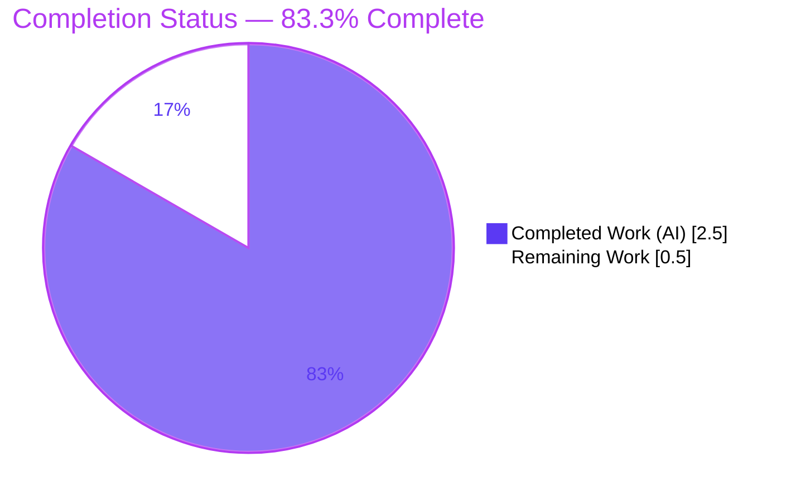
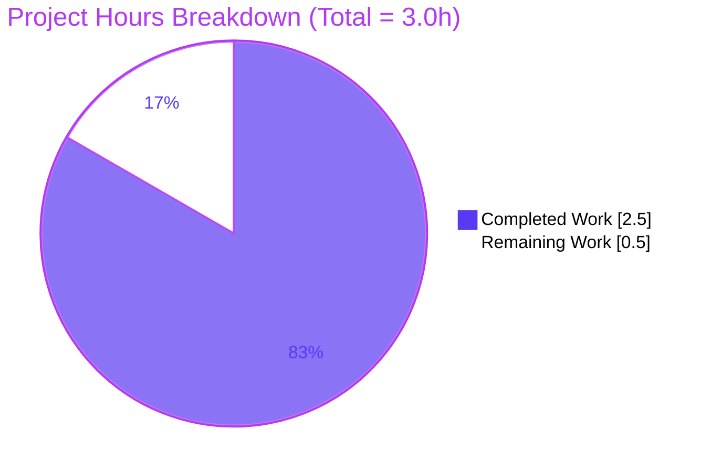

# Blitzy Project Guide — `empty-repo`
### Project: Add_HelloWorld_Java_Prompt

> A dependency-free Java 17 console program that prints `Hello, World!` — the first and only executable artifact introduced into a previously empty repository.

---

## 1. Executive Summary

### 1.1 Project Overview

This project delivers the first executable source artifact for the `empty-repo` repository, which previously contained only a placeholder `README.md`. The objective was to author a single, dependency-free Java 17 console program — `HelloWorld.java` — that prints the exact line `Hello, World!` to standard output. The target users are developers and learners validating a minimal, canonical Java entry point. The technical scope is intentionally narrow and absolute: exactly one `.java` file, one `public class`, the standard `main` entry point, and a single `System.out.println` statement, with no build tools, dependencies, frameworks, tests, or package structure permitted. The deliverable compiles cleanly under JDK 17 and runs with byte-exact output.

### 1.2 Completion Status

The project is **83.3% complete**. All Agent Action Plan (AAP)–scoped engineering work has been autonomously delivered and validated; the remaining work is a single human review-and-sign-off gate.



> Color key (Blitzy brand): **Completed = Dark Blue `#5B39F3`** · **Remaining = White `#FFFFFF`** (outlined in violet `#B23AF2` for visibility).

| Metric | Hours |
| --- | --- |
| **Total Hours** | **3.0** |
| Completed Hours (AI + Manual) | 2.5 |
| &nbsp;&nbsp;• AI / Autonomous | 2.5 |
| &nbsp;&nbsp;• Manual (human) | 0.0 |
| **Remaining Hours** | **0.5** |
| **Percent Complete** | **83.3%** |

> **Calculation:** Completion % = Completed ÷ Total = 2.5 ÷ 3.0 = **83.3%**.

### 1.3 Key Accomplishments

- ✅ Authored `HelloWorld.java` at the repository root in the default package — byte-for-byte identical to the AAP canonical implementation.
- ✅ Compilation gate passed: `javac HelloWorld.java` → exit 0, 0 errors; `javac -Xlint:all` → 0 warnings.
- ✅ Runtime gate passed: `java HelloWorld` → stdout exactly `Hello, World!`.
- ✅ Byte-exact output verified: `od -c` confirms 14 bytes (`Hello, World!` + trailing newline).
- ✅ All prohibition constraints honored: 0 dependencies, 0 imports, 0 package declarations, 1 top-level class, 1 `println`, no tests, no build tooling.
- ✅ Repository integrity preserved: `README.md` unchanged; working tree clean; transient `HelloWorld.class` build artifact removed (not committed).
- ✅ Committed on the correct branch (`6f5b3d9`) by `agent@blitzy.com`.

### 1.4 Critical Unresolved Issues

| Issue | Impact | Owner | ETA |
| --- | --- | --- | --- |
| _None_ | No unresolved issues block release or validation. All five Blitzy validation gates PASS with zero errors and zero warnings. | — | — |

### 1.5 Access Issues

| System/Resource | Type of Access | Issue Description | Resolution Status | Owner |
| --- | --- | --- | --- | --- |
| _None_ | — | No access issues identified. The repository is fully accessible, the deliverable is committed on-branch, and the JDK 17 toolchain is present in the validation environment. No external services, credentials, or third-party APIs are involved. | N/A | — |

> **No access issues identified.**

### 1.6 Recommended Next Steps

1. **[High]** Verify a JDK 17+ toolchain is installed on the review/target machine (`java -version`, `javac -version`).
2. **[High]** Run the compile gate: `javac HelloWorld.java` (expect exit 0, 0 errors).
3. **[High]** Run the run gate and confirm exact output: `java HelloWorld` → `Hello, World!`.
4. **[High]** Review the 5-line source against AAP constraints (single class, default package, exact literal, zero dependencies).
5. **[High]** Approve and merge the PR — the deliverable is production-ready.

> Steps 1–5 are the actionable breakdown of the single remaining task (Final Human Review, 0.5h); they do not add separate hours.

---

## 2. Project Hours Breakdown

### 2.1 Completed Work Detail

All completed work was performed autonomously by Blitzy agents. Each component traces to specific AAP requirements (R1–R14).

| Component | Hours | Description |
| --- | --- | --- |
| `HelloWorld.java` authoring & implementation | 0.5 | Authored the single-class, default-package source with the canonical `main` entry point and exact `System.out.println("Hello, World!")` literal; Java 17–compatible, dependency-free (AAP R1–R9). |
| Compilation gate validation | 0.5 | `javac HelloWorld.java` → exit 0, 0 errors; `javac -Xlint:all` → 0 warnings; static checks (package=0, import=0, class=1, println=1) (AAP R10). |
| Runtime gate validation | 0.5 | `java HelloWorld` → exit 0, exact stdout; byte-exact verification via `od -c` (14 bytes) and character-for-character check; clean-room re-runs (AAP R11–R12). |
| Dependency & toolchain verification | 0.5 | Confirmed zero dependency manifests/lockfiles; verified OpenJDK 17.0.19 (`java`/`javac` on PATH) via smoke test (AAP R6, R14). |
| Source hygiene, commit & artifact cleanup | 0.5 | Whitespace/tab/CRLF/final-newline checks; commit `6f5b3d9`; removed transient `HelloWorld.class`; confirmed clean tree (AAP R13). |
| **Total Completed** | **2.5** | **Sum matches Completed Hours in Section 1.2.** |

### 2.2 Remaining Work Detail

| Category | Hours | Priority |
| --- | --- | --- |
| Final Human Review & Production Sign-off (verify gates, review source, approve/merge PR) | 0.5 | High |
| **Total Remaining** | **0.5** | — |

> **Cross-section check:** Section 2.1 (2.5h) + Section 2.2 (0.5h) = **3.0h** Total (matches Section 1.2). Section 2.2 total (0.5h) = Section 1.2 Remaining = Section 7 pie "Remaining Work".

### 2.3 Notes on Scope

Most conventional path-to-production activities (CI/CD pipelines, deployment, containerization, environment configuration, automated test suites, monitoring/logging, documentation) are **explicitly prohibited or out-of-scope** by the AAP. Consequently they are excluded from the work universe, and the only legitimate remaining item is the human review/merge gate.

---

## 3. Test Results

All entries below originate from Blitzy's autonomous validation logs for this project.

| Test Category | Framework | Total Tests | Passed | Failed | Coverage % | Notes |
| --- | --- | --- | --- | --- | --- | --- |
| Unit Tests | None (prohibited by AAP) | 0 | 0 | 0 | N/A | Vacuous pass by design — the prompt forbids test classes; behavioral correctness is asserted by the Run gate. |
| Compilation Gate | `javac` (JDK 17) | 1 | 1 | 0 | N/A | `javac HelloWorld.java` → exit 0, 0 errors; `javac -Xlint:all` → 0 warnings. |
| Runtime / Behavioral Gate | `java` (JDK 17) | 1 | 1 | 0 | N/A | `java HelloWorld` → exit 0, stdout exactly `Hello, World!`. |
| Output Byte-Exactness | `od -c` / `wc -c` | 1 | 1 | 0 | N/A | Output = 14 bytes (`H e l l o ,  ⎵ W o r l d ! \n`); locale-independent (verified under `LC_ALL=C`). |
| Static Constraint Checks | `grep` counts | 4 | 4 | 0 | N/A | package=0, import=0, top-level class=1, `println`=1. |

**Aggregate:** 7 autonomous validation checks executed, 7 passed, 0 failed. There are **0 automated unit/integration/UI/E2E tests** — this is the required state per the AAP, not a coverage gap.

---

## 4. Runtime Validation & UI Verification

**Runtime health:**
- ✅ **Operational** — Compilation: `javac HelloWorld.java` exits 0 with 0 errors and 0 warnings.
- ✅ **Operational** — Execution: `java HelloWorld` exits 0 and prints `Hello, World!`.
- ✅ **Operational** — Output integrity: byte-exact 14-byte output (`Hello, World!` + newline); `stderr` empty.
- ✅ **Operational** — Reproducibility: clean-room fresh-compile re-runs reproduce identical output; output verified locale-independent.
- ✅ **Operational** — Optional one-step launch: `java HelloWorld.java` (single-file source mode, JEP 330) prints `Hello, World!` with no `.class` artifact created.

**API integration outcomes:**
- ➖ **N/A** — The program performs no network, file, database, or external API I/O. The only runtime linkage is the JDK standard library (`System.out` → `java.io.PrintStream`).

**UI verification:**
- ➖ **N/A** — This is a console program with no graphical or web user interface. The sole user-facing surface is a single line of standard output, which is verified above. No screenshots or visual regression checks apply.

---

## 5. Compliance & Quality Review

AAP deliverables and constraints cross-mapped to validation outcomes.

| # | AAP Requirement / Constraint | Benchmark | Status | Evidence |
| --- | --- | --- | --- | --- |
| R1 | Exactly one `.java` file named `HelloWorld.java` | Single-file rule | ✅ Pass | 1 `.java` file at repo root |
| R2 | Exactly one top-level `public class HelloWorld` | Single-class rule | ✅ Pass | Static check: class=1 |
| R3 | Canonical entry point `public static void main(String[] args)` | Entry-point rule | ✅ Pass | Runs via `java HelloWorld` |
| R4 | Output via `System.out.println("Hello, World!")` (exact literal) | Exact-output rule | ✅ Pass | Static check: println=1; line 3 |
| R5 | Default package (no `package` declaration) | Default-package rule | ✅ Pass | Static check: package=0 |
| R6 | No external dependencies / build tools / frameworks | Dependency-free rule | ✅ Pass | 0 manifests; import=0 |
| R7 | No logging libraries / tests / multi-class structure | No-extras rule | ✅ Pass | 1 class, 0 tests, 0 imports |
| R8 | Java 17+ language level | Toolchain rule | ✅ Pass | Compiles & runs on OpenJDK 17.0.19 |
| R9 | Output is byte-exact (`Hello, World!` + newline) | Exact-output rule | ✅ Pass | `od -c` = 14 bytes |
| R10 | Compile gate: `javac` exit 0, 0 errors | Validation gate | ✅ Pass | exit 0; `-Xlint:all` 0 warnings |
| R11 | Run gate: `java HelloWorld` prints exact line | Validation gate | ✅ Pass | stdout = `Hello, World!` |
| R12 | `README.md` unchanged (preservation rule) | Preservation rule | ✅ Pass | README still `# empty-repo` |
| R13 | Source hygiene & clean working tree | Quality benchmark | ✅ Pass | 0 trailing ws/tabs/CRLF; tree clean |

**Fixes applied during autonomous validation:** None required — the deliverable was correct on arrival. The only housekeeping action was removing the transient `HelloWorld.class` build artifact so it would not be committed.

**Outstanding compliance items:** Final human review/sign-off (Section 2.2). No code-level compliance gaps remain.

---

## 6. Risk Assessment

| Risk | Category | Severity | Probability | Mitigation | Status |
| --- | --- | --- | --- | --- | --- |
| JDK 17+ toolchain absent on reviewer/target machine blocks compile/run | Integration / Environment | Low | Low | Install OpenJDK 17+; verify `java -version` / `javac -version` (see Dev Guide §9) | Mitigated (OpenJDK 17.0.19 verified in env) |
| No automated regression tests guard future edits | Technical | Low | Low | Behavioral correctness asserted by compile + run gates; tests are AAP-prohibited | Accepted by design |
| Attack surface (no input, no network/file/process I/O, no dependencies) | Security | Negligible | Low | No action — program processes no untrusted data and has zero CVE exposure | Closed / No action |
| No monitoring/logging/health-check | Operational | Low | Low | N/A for a one-shot console program; logging libraries are AAP-prohibited | Accepted by design |
| Output encoding/locale variance | Operational | Negligible | Low | Output is pure ASCII; verified identical under `LC_ALL=C` | Closed / No action |

**Overall risk posture: LOW / NEGLIGIBLE.** The only actionable item is ensuring a JDK 17+ toolchain on the consuming machine.

---

## 7. Visual Project Status



> Color key: **Completed = Dark Blue `#5B39F3`** · **Remaining = White `#FFFFFF`**.

**Remaining hours by category (from Section 2.2):**

| Category | Hours | Priority | Share of Remaining |
| --- | --- | --- | --- |
| Final Human Review & Production Sign-off | 0.5 | High | 100% |
| **Total** | **0.5** | — | 100% |

> **Integrity:** "Remaining Work" = **0.5h** here equals Section 1.2 Remaining Hours and the Section 2.2 "Hours" sum. "Completed Work" = **2.5h** equals Section 1.2 Completed Hours.

---

## 8. Summary & Recommendations

**Achievements.** The project is **83.3% complete** (2.5h of 3.0h). The complete and total AAP scope — a single dependency-free Java 17 console program printing `Hello, World!` — has been autonomously implemented, committed (`6f5b3d9`), and exhaustively validated. Every validation gate passes: clean compilation (0 errors, 0 warnings), correct runtime behavior, and byte-exact 14-byte output. Every prohibition constraint is honored (no dependencies, build tools, tests, packages, or multi-class structure), and the existing `README.md` is preserved unchanged.

**Remaining gaps.** The remaining **0.5h** is a single human review-and-sign-off gate. Because the AAP explicitly prohibits build tooling, tests, CI/CD, containers, and deployment artifacts, there is no additional path-to-production work to perform — the program is self-contained and runs against the JDK standard library alone.

**Critical path to production.** Verify the JDK 17+ toolchain → run the compile gate → run the run gate and confirm exact output → review the 5-line source → approve and merge. This is the entirety of the path to production.

**Success metrics (all met).** Compile exit 0 ✓ · Run prints exactly `Hello, World!` ✓ · Output = 14 bytes ✓ · Single class / default package / zero dependencies ✓ · `README.md` unchanged ✓.

**Production readiness assessment.** **READY.** The deliverable is production-ready pending the standard human sign-off reflected in the 83.3% figure (per Blitzy policy, completion is not reported as 100% before human review). Risk posture is LOW/NEGLIGIBLE.

| Success Metric | Target | Actual | Status |
| --- | --- | --- | --- |
| Compilation | exit 0, 0 errors | exit 0, 0 errors, 0 warnings | ✅ |
| Runtime output | `Hello, World!` | `Hello, World!` | ✅ |
| Output size | 14 bytes | 14 bytes | ✅ |
| Class count | 1 | 1 | ✅ |
| Dependencies | 0 | 0 | ✅ |

---

## 9. Development Guide

A complete, copy-pasteable guide for building, running, and troubleshooting the program. All commands were executed and verified in the validation environment.

### 9.1 System Prerequisites

- **Operating system:** Any OS with a JDK (Linux, macOS, or Windows). Validated on Ubuntu (Linux container).
- **Required software:** JDK **17 or newer** (provides `javac` and `java`). Validated on **OpenJDK 17.0.19**.
- **Hardware:** Negligible — a few MB of disk and RAM. No special hardware required.
- **Network/services:** None. No internet access, ports, databases, or background services are needed.

### 9.2 Environment Setup

Confirm the toolchain is present:

```bash
java -version
# Expected (example): openjdk version "17.0.19" 2026-04-21

javac -version
# Expected (example): javac 17.0.19
```

If the JDK is missing, install it:

```bash
# Debian / Ubuntu
sudo apt-get update && sudo apt-get install -y openjdk-17-jdk

# macOS (Homebrew)
brew install openjdk@17

# Cross-platform (SDKMAN)
sdk install java 17.0.7-open
```

> No environment variables are required. Ensure the JDK's `bin` directory is on your `PATH` (and optionally set `JAVA_HOME`).

### 9.3 Dependency Installation

**None.** The program has zero third-party dependencies and no dependency manifest (no `pom.xml`, `build.gradle`, `package.json`, etc.). Nothing to install beyond the JDK itself.

### 9.4 Build & Run

From the repository root:

```bash
# 1) Compile (Compile gate)
javac HelloWorld.java          # exit 0; produces HelloWorld.class

# 2) Run (Run gate)
java HelloWorld                # prints: Hello, World!
```

**Optional — one step, no compilation** (single-file source launch, JEP 330, Java 11+):

```bash
java HelloWorld.java           # prints: Hello, World!  (runs in-memory; no .class created)
```

### 9.5 Verification

```bash
# Confirm exact bytes (expect 14 bytes: "Hello, World!" + newline)
java HelloWorld | od -c
# 0000000   H   e   l   l   o   ,       W   o   r   l   d   !  \n
# 0000016

java HelloWorld | wc -c
# 14
```

Keep the working tree clean by removing the compiled artifact (it must not be committed):

```bash
rm -f HelloWorld.class
git status --porcelain         # (empty output = clean tree)
```

### 9.6 Example Usage

```bash
$ javac HelloWorld.java
$ java HelloWorld
Hello, World!
```

### 9.7 Troubleshooting

| Symptom | Cause | Resolution |
| --- | --- | --- |
| `java: command not found` / `javac: command not found` | JDK 17+ not installed or not on `PATH` | Install OpenJDK 17+ (§9.2); ensure `<jdk>/bin` is on `PATH`; re-check `java -version`. |
| `error: class HelloWorld is public, should be declared in a file named HelloWorld.java` | File was renamed | The public class name must match the filename — keep it exactly `HelloWorld.java`. |
| `Could not find or load main class HelloWorld` | Not compiled, wrong directory, or stale classpath | Run `javac HelloWorld.java` first; run from the directory containing `HelloWorld.class`; use `java HelloWorld` (no `.class`, no package). |
| Output differs / extra characters | The `println` literal was edited | Restore the exact literal `Hello, World!`; verify 14 bytes with `od -c`. |
| `HelloWorld.class` shows in `git status` | Build artifact accidentally staged | Remove it: `rm -f HelloWorld.class`. Only `HelloWorld.java` and `README.md` should be tracked. |

---

## 10. Appendices

### A. Command Reference

| Purpose | Command |
| --- | --- |
| Check runtime version | `java -version` |
| Check compiler version | `javac -version` |
| Compile | `javac HelloWorld.java` |
| Run | `java HelloWorld` |
| One-step run (no compile) | `java HelloWorld.java` |
| Verify output bytes | `java HelloWorld \| od -c` |
| Count output bytes | `java HelloWorld \| wc -c` |
| Remove build artifact | `rm -f HelloWorld.class` |
| Confirm clean tree | `git status --porcelain` |

### B. Port Reference

➖ **N/A** — The program is a one-shot console application. It opens no ports and runs no services.

### C. Key File Locations

| Path | Type | Status | Description |
| --- | --- | --- | --- |
| `HelloWorld.java` | Source | Added (commit `6f5b3d9`) | The single deliverable — `public class HelloWorld` with `main` printing `Hello, World!`. |
| `README.md` | Docs | Unchanged | Repository identity marker (`# empty-repo`); read-only context. |
| `HelloWorld.class` | Build artifact | Not committed | Produced by `javac`; intentionally excluded from version control. |

### D. Technology Versions

| Item | Version | Notes |
| --- | --- | --- |
| Java language level | 17+ | AAP-required target |
| OpenJDK (validation env) | 17.0.19 | `java` & `javac` at `/usr/bin` |
| Git | system | 2 commits on branch; HEAD `6f5b3d9` |

### E. Environment Variable Reference

➖ **N/A** — No environment variables are required to build or run the program. (`JAVA_HOME`/`PATH` are standard JDK setup, not application configuration.)

### F. Developer Tools Guide

| Tool | Role | Notes |
| --- | --- | --- |
| `javac` | Compiler | Compiles `HelloWorld.java` → `HelloWorld.class`; use `-Xlint:all` for strict warnings (currently 0). |
| `java` | Runtime / launcher | Runs the compiled class (`java HelloWorld`) or the source directly (`java HelloWorld.java`, JEP 330). |
| `od` / `wc` | Output verification | Confirm byte-exact 14-byte output. |
| `git` | Version control | Inspect history (`git log`), confirm clean tree (`git status --porcelain`). |

### G. Glossary

| Term | Definition |
| --- | --- |
| **AAP** | Agent Action Plan — the authoritative specification of project scope and requirements. |
| **Default package** | The unnamed Java package used when no `package` declaration is present; required so `java HelloWorld` resolves without a fully-qualified name. |
| **Compile gate** | The validation requirement that `javac HelloWorld.java` exits 0 with no errors. |
| **Run gate** | The validation requirement that `java HelloWorld` prints exactly `Hello, World!`. |
| **JEP 330** | Java Enhancement Proposal enabling single-file source-code launch (`java File.java`) without a separate compile step (Java 11+). |
| **Byte-exact output** | Output verified at the byte level (14 bytes = `Hello, World!` + one trailing newline). |
| **Vacuous pass** | A test category reported as passing because there are zero tests to run (0/0) — here, by design. |

---

*Generated by the Blitzy autonomous assessment agent. All hours, percentages, and test results are derived from the Agent Action Plan and Blitzy's autonomous validation logs, and were independently re-verified against the repository on branch `blitzy-bc5e1e73-d9a7-4e47-901d-ae2aa5c0dfd8` (HEAD `6f5b3d9`).*